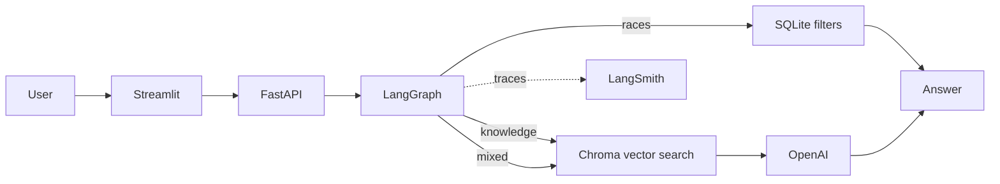

# MaraPal Coach

<p align="right">
  <strong>English</strong> | <a href="README.zh-CN.md">简体中文</a>
</p>

**Live MVP:** [https://talisman-headset-deluge.ngrok-free.dev/](https://talisman-headset-deluge.ngrok-free.dev/)

MaraPal Coach is an evidence-aware running assistant and one part of the wider
**MaraPal** product. This repository is an MVP created as an **LLM Zoomcamp
course project** and is intended for learning and demonstration only. The demo
is self-hosted, so it is available only while the host computer is online.

Users bring their own OpenAI API key. The key is kept only in the current
Streamlit session and is not stored in SQLite, Chroma, application logs, or
LangSmith.

## What it does

MaraPal Coach handles two types of questions:

- **Running knowledge:** retrieves evidence-graded content from running.wiki
  and generates a grounded answer with sources.
- **German races:** converts a natural-language request into exact filters and
  searches structured DLV race data in SQLite.

Examples:

- `What is the difference between LT1 and LT2?`
- `Does beetroot juice improve running performance?`
- `Show me five half marathons in Bayern.`

## Technical flow



### LangGraph workflow

```text
question
   ↓
classify route, writing style, and answer detail
   ├── knowledge → vector retrieval → grounded answer
   ├── races    → structured filters → SQLite search
   └── mixed    → both paths → combined answer
```

The style classifier adapts the presentation to casual, neutral, or academic
wording. It does not change the evidence, citation, or safety requirements.

## Technology stack

| Area | Technology |
|---|---|
| Workflow | LangGraph |
| RAG components | LangChain |
| Vector database | ChromaDB |
| Structured data | SQLite |
| Backend | FastAPI |
| Frontend | Streamlit |
| Generator | OpenAI `gpt-4.1-mini` |
| Embeddings | OpenAI `text-embedding-3-small` |
| LLM evaluation | DeepEval GEval with Gemini judge |
| Tracing | LangSmith |
| Ingestion | Kestra with PostgreSQL metadata |
| Containers | Docker Compose |

## Data sources

| Data | Source | Use |
|---|---|---|
| Running knowledge | [running.wiki](https://running.wiki) and its [source repository](https://github.com/jacquescorbytuech/running-knowledge-base) | Evidence-graded RAG documents |
| German races | [DLV-Laufkalender](https://www.laufen.de/laufkalender) | Dates, locations, distances, and event links |

The running.wiki knowledge base is MIT licensed. Race registration is never
assumed to be open only because an event is in the future. When registration
cannot be verified, the application returns `unknown` and shows the available
event link.

## Evaluation results

### Retrieval

The same 15 labelled questions were used to compare BM25, vector, and hybrid
retrieval at Top-5.

| Retriever | Hit@5 | MRR@5 | Mean latency |
|---|---:|---:|---:|
| BM25 | 0.6000 | 0.4389 | 2.93 ms |
| Vector | **0.8667** | **0.7500** | 428.27 ms |
| Hybrid (RRF) | **0.8667** | 0.5722 | 241.68 ms |

Vector retrieval had the best MRR@5 and is used in the application.

### LLM output

OpenAI generated the answers and Gemini judged two prompt variants through
DeepEval GEval. Both prompts used the same frozen Vector Top-5 context.

| Metric | Prompt A | Prompt B |
|---|---:|---:|
| Faithfulness | **1.0000** | **1.0000** |
| Answer relevancy | 0.8733 | **0.8759** |
| Evidence fidelity | **0.9667** | 0.9467 |
| Completeness | 0.9067 | **0.9267** |
| Style alignment | **0.9867** | 0.9733 |
| Deterministic checks | **1.0000** | **1.0000** |
| Mean generation latency | **6,963.88 ms** | 14,492.64 ms |

Prompt A is used because it kept stronger evidence fidelity and style alignment
while generating answers much faster.

## Run with Docker

Requirements:

- Git
- Docker with Docker Compose
- An OpenAI API key for the initial knowledge index and Kestra ingestion

Clone the project and source knowledge:

```bash
git clone <YOUR-MARAPAL-REPOSITORY-URL>
cd MaraPal
git clone https://github.com/jacquescorbytuech/running-knowledge-base \
  data/raw/running-wiki
cp .env.example .env
```

Add the required values to `.env`, then initialize the local data once:

```bash
docker compose build api
docker compose run --rm api python ingest/wiki.py \
  --wiki data/raw/running-wiki --out /data/processed/knowledge.jsonl
docker compose run --rm api marapal index \
  --input /data/processed/knowledge.jsonl
docker compose run --rm api python ingest/dlv_calendar.py \
  --out /data/processed/races.jsonl
docker compose run --rm api marapal import-races \
  /data/processed/races.jsonl
```

Start everything:

```bash
docker compose up -d --build
docker compose ps
```

| Service | Local address |
|---|---|
| Streamlit | `http://localhost:8501` |
| FastAPI and API docs | `http://localhost:8000/docs` |
| Monitoring | `http://localhost:8000/monitoring` |
| Kestra | `http://localhost:8080` |

Stop the stack with:

```bash
docker compose down
```

## Kestra ingestion

The flow in [`kestra/ingestion.yml`](kestra/ingestion.yml) runs every Monday at
04:00 Europe/Berlin and can also be started manually.

```text
parse running.wiki
      ↓
fetch DLV race data
      ↓
index Chroma
      ↓
import races into SQLite
      ↓
run retrieval evaluation
```

After starting Docker Compose, open `http://localhost:8080`, import
`kestra/ingestion.yml` into the `marapal` namespace, save it, and select
**Execute**. `KESTRA_SECRET_OPENAI_API_KEY` from `.env` is used for indexing;
it is separate from the API key entered by application users.

## Tests

The ordinary test suite is offline and does not call OpenAI, Gemini, or
LangSmith:

```bash
uv run pytest -q
```

## Disclaimer

MaraPal Coach is a learning project and provides general running information,
not medical diagnosis, treatment, or personalized medical advice. MaraPal is
not affiliated with running.wiki, DLV, or laufen.de.
