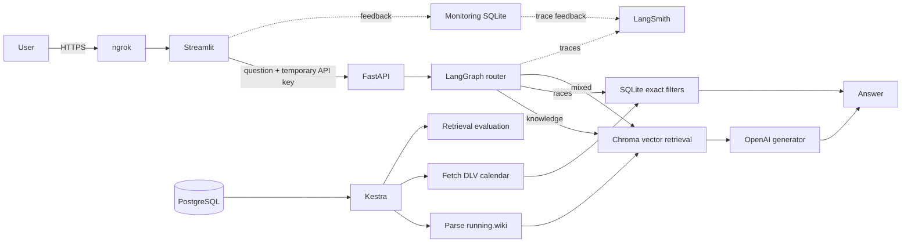

# MaraPal Coach

<p align="right">
  <strong>English</strong> | <a href="README.zh-CN.md">简体中文</a>
</p>

An evidence-aware running assistant by MaraPal, built with
LangChain, LangGraph, ChromaDB, FastAPI, Streamlit, Kestra, LangSmith, and
Docker Compose.

> **Live demo:** [Open MaraPal Coach](https://talisman-headset-deluge.ngrok-free.dev)
>
> The demo is self-hosted and is available while the host computer is online.
> It uses Bring Your Own Key (BYOK): enter an OpenAI API key in the Streamlit
> sidebar and MaraPal keeps it only for the current browser session.

## The problem

Running advice is abundant but difficult to assess. Scientific evidence,
marketing claims, personal anecdotes, and outdated guidance frequently appear
side by side. A runner asking whether beetroot juice helps, how to structure a
taper, or what LT1 means needs an answer that is grounded in sources and honest
about uncertainty.

MaraPal Coach solves two related problems:

1. **Evidence-aware running Q&A.** It retrieves evidence-graded material from
   [running.wiki](https://running.wiki), generates an answer from that context,
   preserves evidence strength, and provides source links.
2. **German race discovery.** It converts natural-language race requests into
   exact SQLite filters over DLV calendar records. Dates, cities, distances,
   and registration states are structured data rather than semantic guesses.

Example questions:

- `Easy runs—do I really need that many?`
- `What is the difference between LT1 and LT2?`
- `Does sodium bicarbonate improve distance-running performance?`
- `Show me five half marathons in Bayern.`
- `Which races near München are still available this autumn?`

## Key features

- LangGraph routing between knowledge, race, and mixed questions
- Vector RAG over a persistent ChromaDB collection
- Exact German race filtering in SQLite
- BM25, vector, and hybrid retrieval benchmark
- Evidence grades and source links carried from ingestion to the answer
- Casual, neutral, and academic style alignment with configurable answer detail
- FastAPI backend and Streamlit multipage frontend
- BYOK OpenAI authentication with preflight key validation
- Per-browser-session rate limit of 10 questions per 60 seconds
- LangSmith traces and trace-linked thumbs-up/down feedback
- Separate monitoring dashboard with six charts
- Scheduled Kestra ingestion backed by PostgreSQL
- Docker Compose for the complete application and ingestion stack
- Optional public HTTPS demo through ngrok

## Architecture



The knowledge and race paths deliberately remain separate. Semantic retrieval
is appropriate for prose; race discovery needs deterministic filters. A race
that sounds relevant but has the wrong date or distance is not a valid result.

### LangGraph flow

```text
question
   ↓
route + style + detail analysis
   ├── knowledge → vector retrieval → grounded generation
   ├── races    → structured filter extraction → SQLite search
   └── mixed    → both paths → combined answer
```

The routing call also classifies presentation style as `casual`, `neutral`, or
`academic`, and detail as `brief`, `standard`, or `detailed`. Style changes
presentation only; it never relaxes grounding, citation, evidence, or safety
requirements.

## Technology

| Layer | Technology | Responsibility |
|---|---|---|
| Orchestration | LangGraph | Typed routing and knowledge/race workflow |
| RAG components | LangChain | Documents, prompts, retrievers, structured output |
| Vector database | ChromaDB | Persistent running.wiki embeddings |
| Structured database | SQLite | Exact race filters and local monitoring |
| Generator | OpenAI `gpt-4.1-mini` | Routing, structured extraction, and answers |
| Embeddings | OpenAI `text-embedding-3-small` | Index and query vectors |
| LLM judge | Gemini via DeepEval | Prompt A/B output evaluation |
| Backend | FastAPI | Ask, key validation, feedback, and monitoring APIs |
| Frontend | Streamlit | Chat, sources, BYOK, feedback, and Privacy page |
| Observability | LangSmith | Nested traces and feedback synchronization |
| Ingestion | Kestra | Scheduled parse, fetch, index, import, and evaluation |
| Infrastructure | Docker Compose + PostgreSQL | Reproducible local stack and Kestra metadata |
| Public demo | ngrok | HTTPS tunnel to localhost Streamlit only |

## Data sources

| Data | Source | Notes |
|---|---|---|
| Running knowledge | [running.wiki](https://running.wiki) / [source repository](https://github.com/jacquescorbytuech/running-knowledge-base) | MIT-licensed, evidence-graded Markdown with primary-source links |
| German races | [DLV-Laufkalender](https://www.laufen.de/laufkalender) | Official DLV event calendar; fetched as dated snapshots |
| Registration links | DLV and organizer pages | Unknown is preserved when registration cannot be verified |

### Evidence grades

The upstream grade is stored as Chroma metadata and included in the generation
context.

| Grade | Interpretation |
|---|---|
| `strong` | Consistent trials, meta-analyses, or consensus guidance |
| `moderate` | Several supporting studies with meaningful caveats |
| `limited` | Preliminary, thin, or mixed evidence |
| `weak` | Little credible support or claims exceed the evidence |
| `contested` | Genuine disagreement in the literature |

### Registration status safety

The DLV calendar does not prove that registration is open. MaraPal never infers
`open` merely because an event is in the future.

| Status | Meaning |
|---|---|
| `not_yet_open` | Registration has not opened |
| `open` | Regular registration is available |
| `late_only` | Only late registration (`Nachmeldung`) is available |
| `sold_out` | Field limit reached |
| `closed` | Registration is closed |
| `unknown` | Not verified; show the available event URL honestly |

## Retrieval evaluation

The labelled benchmark contains 15 questions and evaluates BM25, vector, and
hybrid retrieval on the same knowledge chunks using Hit@5, MRR@5, and latency.

| Retriever | Hit@5 | MRR@5 | Mean latency |
|---|---:|---:|---:|
| BM25 | 0.6000 | 0.4389 | 2.93 ms |
| Vector | **0.8667** | **0.7500** | 428.27 ms |
| Hybrid (RRF) | **0.8667** | 0.5722 | 241.68 ms |

Selection is lexicographic: MRR@5, then Hit@5, then latency. **Vector search won
and is the production retriever.** Hybrid search remains implemented and
reproducible as an evaluated alternative.

Run the benchmark:

```bash
uv run python -m eval.retrieval
```

The report is written to `eval/results/retrieval.json` (generated results are
ignored by Git).

## LLM evaluation

Generation and judging use separate providers:

- Generator: `gpt-4.1-mini`
- Judge: Gemini through DeepEval GEval
- Retrieval: frozen vector Top-5 context for both prompt variants
- Dataset: 15 generation goldens

The experiment evaluates faithfulness, answer relevancy, evidence fidelity,
completeness, style alignment, deterministic citation/disclaimer checks, and
latency.

| Metric | Prompt A | Prompt B |
|---|---:|---:|
| Faithfulness | **1.0000** | **1.0000** |
| Answer relevancy | 0.8733 | **0.8759** |
| Evidence fidelity | **0.9667** | 0.9467 |
| Completeness | 0.9067 | **0.9267** |
| Style alignment | **0.9867** | 0.9733 |
| Deterministic pass rate | **1.0000** | **1.0000** |
| Mean generation latency | **6,963.88 ms** | 14,492.64 ms |

The selection rule prioritizes faithfulness, evidence fidelity, deterministic
checks, answer relevancy, completeness, style alignment, and finally latency.
**Prompt A won and remains the production prompt.**

Run a low-cost smoke case, then the complete experiment:

```bash
uv run python -m eval.generation --limit 1
uv run python -m eval.generation
```

The evaluator checkpoints cases and resumes compatible runs. These commands use
OpenAI and Gemini APIs and can incur charges; ordinary unit tests remain offline.

## BYOK and privacy

The public web application does not use the project owner's OpenAI key for user
questions.

1. The user enters a key in the Streamlit password field.
2. Streamlit asks FastAPI to validate authentication with OpenAI.
3. A valid key is kept in `st.session_state` for that browser session only.
4. Streamlit sends it to FastAPI in `X-OpenAI-API-Key` over HTTPS.
5. FastAPI injects it into request-scoped chat and embedding clients.
6. The key is not placed in LangGraph state, LangSmith metadata, SQLite, Chroma,
   URLs, or application error messages.

LangSmith may contain the question, retrieved context, prompt, answer, route,
latency, model details, and feedback. Local monitoring stores operational data
and question text until the operator deletes it. Users should not submit highly
sensitive information.

The independent Streamlit **Privacy** page explains this behavior to users.

## API behavior

`POST /api/v1/ask` accepts a question and requires a user OpenAI key header.
Each browser session is limited to 10 questions in a sliding 60-second window.
The eleventh request returns `429` with a `Retry-After` header.

Provider failures are sanitized:

| Status | Meaning |
|---:|---|
| 401 | Invalid, expired, or revoked OpenAI key |
| 403 | Key lacks permission for the required model or endpoint |
| 429 | OpenAI rate, credit, usage, or spending limit reached |
| 503 | Provider network, timeout, overload, or server failure |

Direct example:

```bash
curl -X POST http://localhost:8000/api/v1/ask \
  -H 'Content-Type: application/json' \
  -H "X-OpenAI-API-Key: $OPENAI_API_KEY" \
  -H 'X-MaraPal-Visitor-ID: curl-demo' \
  -d '{"question":"What is LT1?"}'
```

Interactive API documentation is available locally at
`http://localhost:8000/docs`.

## Monitoring and feedback

When `LANGSMITH_TRACING=true`, LangChain and LangGraph operations appear as
nested LangSmith traces. The API assigns explicit trace and interaction IDs.
Streamlit thumbs-up/down feedback is stored locally and synchronized to the
matching LangSmith trace when LangSmith is available.

The separate monitoring dashboard is available only on the host machine:

```text
http://localhost:8000/monitoring
```

It contains six charts:

1. Requests by day
2. Route distribution
3. Answer-style distribution
4. Average latency by route
5. User feedback
6. Request status

Monitoring is intentionally not embedded in the Streamlit chat interface.

## Quick start with Docker Compose

### Prerequisites

- Git
- Docker Engine with Docker Compose
- An OpenAI API key for initial indexing and the Kestra ingestion job
- Optional: Gemini and LangSmith keys for evaluation and tracing

### 1. Clone the project and accessible dataset

```bash
git clone <YOUR-MARAPAL-REPOSITORY-URL>
cd MaraPal
git clone https://github.com/jacquescorbytuech/running-knowledge-base \
  data/raw/running-wiki
```

The raw and generated data directories are reproducible and intentionally not
committed. Each processed knowledge record stores the upstream wiki commit SHA.

### 2. Configure environment variables

```bash
cp .env.example .env
```

Edit `.env` and set at least:

```dotenv
OPENAI_API_KEY=your-indexing-key
KESTRA_DB_USER=kestra
KESTRA_DB_PASSWORD=choose-a-long-random-password
KESTRA_DB_NAME=kestra
KESTRA_SECRET_OPENAI_API_KEY=base64-encoded-openai-key
```

Kestra environment secrets must be base64 encoded. Generate the value without
printing the original key:

```bash
python3 -c 'import base64,getpass; print(base64.b64encode(getpass.getpass("OpenAI key: ").encode()).decode())'
```

Never commit `.env`.

### 3. Build the API image and initialize data

Clone the wiki before building so the ingestion container can read it.

```bash
docker compose build api

docker compose run --rm api \
  python ingest/wiki.py \
  --wiki data/raw/running-wiki \
  --out /data/processed/knowledge.jsonl

docker compose run --rm api \
  marapal index --input /data/processed/knowledge.jsonl

docker compose run --rm api \
  python ingest/dlv_calendar.py \
  --out /data/processed/races.jsonl

docker compose run --rm api \
  marapal import-races /data/processed/races.jsonl
```

### 4. Start the complete stack

```bash
docker compose up -d --build
docker compose ps
```

Local services:

| Service | URL | Exposure |
|---|---|---|
| Streamlit | `http://localhost:8501` | Host loopback only |
| FastAPI | `http://localhost:8000` | Host loopback only |
| Monitoring | `http://localhost:8000/monitoring` | Host loopback only |
| Kestra | `http://localhost:8080` | Host loopback only |
| PostgreSQL | none | Docker network only |

API, Streamlit, and Kestra are not bound to the LAN. The public ngrok tunnel
targets Streamlit only.

### 5. Stop the stack

```bash
docker compose down
```

Do not add `-v` unless you intentionally want to remove Kestra/PostgreSQL
volumes.

## Local Python development

Python 3.11+ and [uv](https://docs.astral.sh/uv/) are recommended. Exact resolved
dependency versions are recorded in `uv.lock`.

```bash
uv sync
cp .env.example .env

git clone https://github.com/jacquescorbytuech/running-knowledge-base \
  data/raw/running-wiki

uv run python ingest/wiki.py
uv run marapal index

uv run python ingest/dlv_calendar.py \
  --out data/raw/races/dlv/$(date +%F).jsonl
uv run marapal import-races data/raw/races/dlv/$(date +%F).jsonl
```

Run the applications in separate terminals:

```bash
uv run uvicorn app.api:app --reload --port 8000
uv run streamlit run app/streamlit_app.py
```

The CLI remains useful for retrieval experiments and uses `OPENAI_API_KEY` from
`.env`:

```bash
uv run marapal ask "How should I taper for a marathon?"
uv run marapal ask "Marathons near München in October"
uv run marapal ask --retrieval-mode hybrid "What is LT2?"
```

`python-dotenv` loads `.env`; shell `source` or `set -a` is not required.

## Automated ingestion with Kestra

The flow at [`kestra/ingestion.yml`](kestra/ingestion.yml) runs every Monday at
04:00 Europe/Berlin and can also be triggered manually. It performs:

```text
parse running.wiki
      ↓
fetch DLV race calendar
      ↓
index Chroma
      ↓
import races into SQLite
      ↓
run retrieval evaluation
```

Start the stack and open `http://localhost:8080`. In Kestra:

1. Open **Flows**.
2. Create/import the contents of `kestra/ingestion.yml` in namespace `marapal`.
3. Save the flow.
4. Select **Execute** to trigger a manual run.
5. Inspect task logs and confirm every stage succeeds.

`KESTRA_SECRET_OPENAI_API_KEY` becomes the Kestra secret
`OPENAI_API_KEY`; it is used for indexing and retrieval evaluation. The user
BYOK key is unrelated and is never stored in Kestra.

## Public demo with ngrok

The host machine currently publishes only Streamlit:

```bash
ngrok http 8501
```

The repository includes [`deploy/ngrok-marapal.service`](deploy/ngrok-marapal.service)
as a user-level systemd template. Update its absolute ngrok path for another
machine before installing it.

Useful commands on the configured host:

```bash
systemctl --user status ngrok-marapal
systemctl --user restart ngrok-marapal
journalctl --user -u ngrok-marapal -f
```

ngrok is transport, not hosting. The demo is offline when the computer is off,
asleep, disconnected, or Docker is stopped.

## Tests

Unit and integration-style tests are offline and do not send ordinary test runs
to LangSmith:

```bash
uv run pytest -q
```

Coverage includes knowledge metadata, citations, BM25/hybrid behavior, race
filters, style alignment, monitoring, feedback, BYOK validation, sanitized
provider errors, and the 10-requests-per-minute limiter.

## Project structure

```text
MaraPal/
├── app/                    # FastAPI, Streamlit, Privacy, monitoring HTML
├── data/
│   ├── raw/                # Reproducible source clones and race snapshots
│   ├── processed/          # Knowledge JSONL and SQLite databases
│   └── vector/             # Persistent Chroma collection
├── deploy/                 # ngrok user-service template
├── docker/                 # API and Streamlit Dockerfiles
├── eval/                   # Retrieval and generation benchmarks
├── ingest/                 # Wiki and DLV ingestion code
├── kestra/                 # Scheduled ingestion flow
├── rag/                    # Graph, retrieval, prompts, races, style, monitoring
├── tests/                  # Offline test suite
├── docker-compose.yaml     # Complete application and Kestra stack
├── pyproject.toml          # Direct dependency declarations
└── uv.lock                 # Fully resolved dependency versions
```

## Evaluation rubric status

| Criterion | Evidence | Score |
|---|---|---:|
| Problem description | Problem, user need, data scope, and safety behavior documented | 2/2 |
| Retrieval flow | Chroma knowledge base + LLM, with separate structured race path | 2/2 |
| Retrieval evaluation | BM25, vector, and hybrid compared; vector selected | 2/2 |
| LLM evaluation | Two prompts judged; Prompt A selected | 2/2 |
| Interface | Streamlit UI and FastAPI API | 2/2 |
| Ingestion pipeline | Scheduled Kestra workflow | 2/2 |
| Monitoring | Feedback plus a dashboard with six charts | 2/2 |
| Containerization | Complete app and dependencies in Docker Compose | 2/2 |
| Reproducibility | Accessible upstream data, complete instructions, locked versions | 2/2 |
| Hybrid search | Implemented and evaluated | +1 |
| Document reranking | Not implemented | +0 |
| Query rewriting | Not implemented | +0 |
| Cloud deployment | Self-hosted ngrok demo, not cloud hosting | +0 |

Expected course score from the listed criteria: **19/21 before optional bonus
features**. Final scoring remains at the evaluator's discretion.

## Known limitations and roadmap

- The 15-question retrieval benchmark is useful for model selection but still
  small; expand it with more English and German questions.
- Registration status enrichment is incomplete, so unresolved events remain
  explicitly `unknown`.
- The rate limiter is in memory and resets with FastAPI; use Redis for a
  multi-worker or multi-host deployment.
- The ngrok demo depends on one host computer and has no uptime guarantee.
- Evaluate a cross-encoder reranker.
- Evaluate query rewriting, especially for mixed-language queries.
- Add an explicit monitoring-data retention/deletion policy.

## Attribution and disclaimer

The running.wiki knowledge base is MIT licensed. Preserve its copyright and
license notice when redistributing source content, and credit running.wiki in
answers and derived work. MaraPal is not affiliated with running.wiki, DLV, or
laufen.de.

MaraPal provides informational running content, not medical diagnosis,
treatment, or individualized coaching advice.
