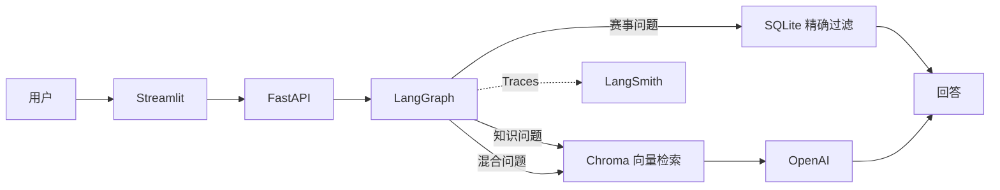

# MaraPal Coach

<p align="right">
  <a href="README.md">English</a> | <strong>简体中文</strong>
</p>

**在线 MVP：** [https://talisman-headset-deluge.ngrok-free.dev/](https://talisman-headset-deluge.ngrok-free.dev/)

MaraPal Coach 是一个基于证据的跑步助手，也是完整 **MaraPal** 产品的一部分。
这个仓库是作为 **LLM Zoomcamp 课程作业**开发的 MVP，仅用于学习和功能展示。
演示服务运行在开发者自己的电脑上，因此只有主机在线时才能访问。

用户需要提供自己的 OpenAI API Key。Key 只保存在当前 Streamlit Session 中，
不会写入 SQLite、Chroma、应用日志或 LangSmith。

## 项目功能

MaraPal Coach 处理两类问题：

- **跑步知识问答：** 从 running.wiki 检索带证据等级的内容，根据检索结果
  生成回答并给出来源。
- **德国赛事搜索：** 将自然语言要求转换成精确过滤条件，再到 SQLite 中搜索
  结构化的 DLV 赛事数据。

问题示例：

- `LT1 和 LT2 有什么区别？`
- `甜菜根汁可以提高跑步表现吗？`
- `帮我找五场在 Bayern 举办的半程马拉松。`

## 技术路线



### LangGraph 工作流

```text
用户问题
   ↓
判断路由、表达风格和回答详细程度
   ├── knowledge → 向量检索 → 基于证据生成回答
   ├── races    → 提取结构化条件 → SQLite 搜索
   └── mixed    → 同时执行两条路径 → 合并回答
```

风格分类会根据用户的表达选择口语、普通或学术风格，但不会改变证据、引用和
安全要求。

## 技术栈

| 部分 | 技术 |
|---|---|
| 工作流 | LangGraph |
| RAG 组件 | LangChain |
| 向量数据库 | ChromaDB |
| 结构化数据 | SQLite |
| 后端 | FastAPI |
| 前端 | Streamlit |
| 生成模型 | OpenAI `gpt-4.1-mini` |
| Embedding | OpenAI `text-embedding-3-small` |
| LLM 评估 | DeepEval GEval + Gemini Judge |
| Tracing | LangSmith |
| 数据摄取 | Kestra，使用 PostgreSQL 保存元数据 |
| 容器 | Docker Compose |

## 数据来源

| 数据 | 来源 | 用途 |
|---|---|---|
| 跑步知识 | [running.wiki](https://running.wiki) 和它的[源代码仓库](https://github.com/jacquescorbytuech/running-knowledge-base) | 带证据等级的 RAG 文档 |
| 德国赛事 | [DLV-Laufkalender](https://www.laufen.de/laufkalender) | 赛事日期、地点、距离和链接 |

running.wiki 使用 MIT License。系统不会因为比赛日期还没到就默认报名仍然开放。
如果无法验证报名状态，会返回 `unknown` 并提供已有的赛事链接。

## Evaluation 结果

### Retrieval Evaluation

使用相同的 15 个标注问题，对 BM25、Vector 和 Hybrid 的 Top-5 结果进行比较。

| Retriever | Hit@5 | MRR@5 | 平均延迟 |
|---|---:|---:|---:|
| BM25 | 0.6000 | 0.4389 | 2.93 ms |
| Vector | **0.8667** | **0.7500** | 428.27 ms |
| Hybrid (RRF) | **0.8667** | 0.5722 | 241.68 ms |

Vector Retrieval 的 MRR@5 最好，因此应用最终选择 Vector Search。

### LLM Evaluation

OpenAI 负责生成回答，Gemini 通过 DeepEval GEval 对两个 Prompt 进行评估。
两个 Prompt 使用相同且固定的 Vector Top-5 上下文。

| 指标 | Prompt A | Prompt B |
|---|---:|---:|
| Faithfulness | **1.0000** | **1.0000** |
| Answer relevancy | 0.8733 | **0.8759** |
| Evidence fidelity | **0.9667** | 0.9467 |
| Completeness | 0.9067 | **0.9267** |
| Style alignment | **0.9867** | 0.9733 |
| Deterministic checks | **1.0000** | **1.0000** |
| 平均生成延迟 | **6,963.88 ms** | 14,492.64 ms |

Prompt A 的 Evidence Fidelity 和 Style Alignment 更好，而且生成速度明显更快，
所以最终使用 Prompt A。

## 使用 Docker

需要准备：

- Git
- Docker 和 Docker Compose
- 用于第一次建立索引和 Kestra Ingestion 的 OpenAI API Key

克隆项目和知识数据：

```bash
git clone <YOUR-MARAPAL-REPOSITORY-URL>
cd MaraPal
git clone https://github.com/jacquescorbytuech/running-knowledge-base \
  data/raw/running-wiki
cp .env.example .env
```

在 `.env` 中填写需要的配置，然后第一次运行时初始化本地数据：

```bash
docker compose build api
docker compose run --rm api python ingest/wiki.py \
  --wiki data/raw/running-wiki --out /data/processed/knowledge.jsonl
docker compose run --rm api marapal index \
  --input /data/processed/knowledge.jsonl
docker compose run --rm api python ingest/dlv_calendar.py \
  --out /data/processed/races.jsonl
docker compose run --rm api marapal import-races \
  /data/processed/races.jsonl
```

启动完整服务：

```bash
docker compose up -d --build
docker compose ps
```

| 服务 | 本地地址 |
|---|---|
| Streamlit | `http://localhost:8501` |
| FastAPI 和 API 文档 | `http://localhost:8000/docs` |
| Monitoring | `http://localhost:8000/monitoring` |
| Kestra | `http://localhost:8080` |

停止服务：

```bash
docker compose down
```

## Kestra Ingestion

[`kestra/ingestion.yml`](kestra/ingestion.yml) 每周一欧洲柏林时间 04:00 自动运行，
也可以手动启动。

```text
解析 running.wiki
      ↓
获取 DLV 赛事数据
      ↓
建立 Chroma 索引
      ↓
将赛事导入 SQLite
      ↓
运行 Retrieval Evaluation
```

Docker Compose 启动后打开 `http://localhost:8080`，将
`kestra/ingestion.yml` 导入 `marapal` Namespace，保存后点击 **Execute**。
`.env` 中的 `KESTRA_SECRET_OPENAI_API_KEY` 用于建立索引，与应用用户输入的
API Key 无关。

## 测试

普通测试保持离线，不会请求 OpenAI、Gemini 或 LangSmith：

```bash
uv run pytest -q
```

## 免责声明

MaraPal Coach 是学习项目，只提供一般跑步信息，不构成医疗诊断、治疗或个性化
医疗建议。MaraPal 与 running.wiki、DLV 和 laufen.de 没有关联。
