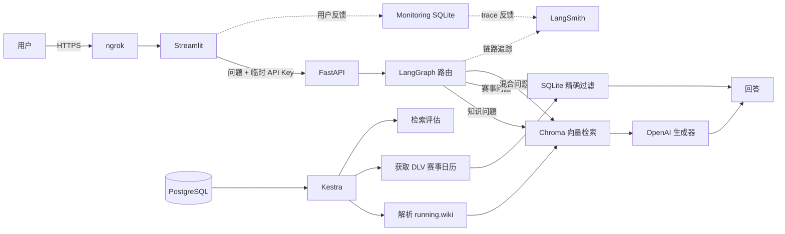

# MaraPal Coach

<p align="right">
  <a href="README.md">English</a> | <strong>简体中文</strong>
</p>

MaraPal 旗下基于证据的跑步助手，使用 LangChain、LangGraph、ChromaDB、
FastAPI、Streamlit、Kestra、LangSmith 和 Docker Compose 构建。

> **在线演示：** [打开 MaraPal Coach](https://talisman-headset-deluge.ngrok-free.dev)
>
> 演示服务部署在开发者自己的电脑上，因此只有主机在线时才能访问。
> 项目采用 BYOK（自带密钥）模式：在 Streamlit 侧边栏输入 OpenAI API Key，
> MaraPal Coach 只会在当前浏览器会话中临时保存它。

## 项目解决的问题

互联网上的跑步建议很多，但质量很难判断。科学证据、营销内容、个人经验和
过时观点经常混在一起。跑者询问甜菜根汁是否有效、如何安排马拉松减量期，
或者 LT1 是什么时，需要的是有来源、有证据等级，并且能坦诚表达不确定性的答案。

MaraPal Coach 解决两个相互关联的问题：

1. **基于证据的跑步问答。** 从 [running.wiki](https://running.wiki)
   检索带证据等级的内容，根据上下文生成答案，保留证据强弱并给出来源链接。
2. **德国跑步赛事发现。** 将自然语言赛事需求转换为 SQLite 精确过滤条件。
   日期、城市、距离和报名状态使用结构化数据，而不是依靠语义猜测。

问题示例：

- `轻松跑真的需要占这么高的比例吗？`
- `LT1 和 LT2 有什么区别？`
- `碳酸氢钠能提高长跑表现吗？`
- `帮我找五场在 Bayern 举办的半程马拉松。`
- `今年秋天 München 附近还有哪些比赛可以报名？`

## 主要功能

- 使用 LangGraph 在知识问答、赛事搜索和混合问题之间路由
- 基于 ChromaDB 持久化向量库的 RAG
- 使用 SQLite 精确过滤德国赛事
- 对 BM25、Vector 和 Hybrid 检索进行对比评估
- 从数据摄取到最终回答全程保留证据等级和来源链接
- 根据用户表达自动匹配口语、普通或学术风格，并控制回答详细程度
- FastAPI 后端和 Streamlit 多页面前端
- 用户自带 OpenAI API Key，并在请求前验证密钥
- 每个浏览器会话每 60 秒最多提出 10 个问题
- LangSmith 链路追踪，以及与 trace 关联的点赞/点踩反馈
- 独立 Monitoring 页面，包含 6 个图表
- Kestra 定时摄取数据，PostgreSQL 保存 Kestra 元数据
- 使用 Docker Compose 启动完整应用和数据管道
- 可通过 ngrok 提供 HTTPS 公开演示

## 系统架构



知识检索和赛事检索被刻意分开：文章内容适合语义检索，而赛事日期、地点和
距离需要确定性的精确过滤。语义上相似但日期或距离不符合条件的赛事不是有效结果。

### LangGraph 工作流

```text
用户问题
   ↓
路由 + 风格 + 详细程度分析
   ├── knowledge → 向量检索 → 基于证据生成回答
   ├── races    → 提取结构化条件 → SQLite 搜索
   └── mixed    → 同时执行两条路径 → 合并回答
```

路由调用还会将表达风格分类为 `casual`、`neutral` 或 `academic`，将详细程度
分类为 `brief`、`standard` 或 `detailed`。风格只改变表达方式，不会降低
事实依据、引用、证据等级或安全要求。

## 技术栈

| 层级 | 技术 | 作用 |
|---|---|---|
| 工作流编排 | LangGraph | 类型化路由和知识/赛事工作流 |
| RAG 组件 | LangChain | 文档、Prompt、Retriever 和结构化输出 |
| 向量数据库 | ChromaDB | 持久化 running.wiki embeddings |
| 结构化数据库 | SQLite | 赛事精确过滤和本地监控数据 |
| 生成模型 | OpenAI `gpt-4.1-mini` | 路由、结构化提取和回答生成 |
| Embedding | OpenAI `text-embedding-3-small` | 文档索引和查询向量 |
| LLM Judge | Gemini + DeepEval | GEval Prompt A/B 输出评估 |
| 后端 | FastAPI | 问答、Key 验证、反馈和监控 API |
| 前端 | Streamlit | 聊天、来源、BYOK、反馈和 Privacy 页面 |
| 可观测性 | LangSmith | 嵌套 traces 和反馈同步 |
| 数据摄取 | Kestra | 定时解析、抓取、索引、导入和评估 |
| 基础设施 | Docker Compose + PostgreSQL | 可复现本地环境和 Kestra 元数据 |
| 公开演示 | ngrok | 将本地 Streamlit 暴露为 HTTPS 地址 |

## 数据来源

| 数据 | 来源 | 说明 |
|---|---|---|
| 跑步知识 | [running.wiki](https://running.wiki) / [源代码仓库](https://github.com/jacquescorbytuech/running-knowledge-base) | MIT 许可、包含证据等级和原始来源链接的 Markdown |
| 德国赛事 | [DLV-Laufkalender](https://www.laufen.de/laufkalender) | DLV 官方赛事日历，以带日期的快照保存 |
| 报名链接 | DLV 和赛事主办方页面 | 无法验证时会明确保留为 unknown |

### 证据等级

上游数据的等级作为 Chroma metadata 保存，并一起传入生成上下文。

| 等级 | 含义 |
|---|---|
| `strong` | 多项一致的试验、Meta-analysis 或共识指南 |
| `moderate` | 多项研究支持，但存在重要限制 |
| `limited` | 初步、较少或结论不一致的证据 |
| `weak` | 可信支持很少，或宣传超过实际证据 |
| `contested` | 学术研究中存在真正的分歧 |

### 报名状态安全策略

赛事出现在 DLV 日历中不代表仍可报名。MaraPal Coach 不会仅仅因为赛事日期
还没到，就推断其状态为 `open`。

| 状态 | 含义 |
|---|---|
| `not_yet_open` | 报名尚未开始 |
| `open` | 可以正常报名 |
| `late_only` | 只接受补报名（Nachmeldung） |
| `sold_out` | 名额已满 |
| `closed` | 报名已关闭 |
| `unknown` | 尚未验证；如实提供已有赛事链接 |

## 检索评估

评估集包含 15 个带标签的问题，在相同知识块上比较 BM25、Vector 和 Hybrid，
指标为 Hit@5、MRR@5 和延迟。

| Retriever | Hit@5 | MRR@5 | 平均延迟 |
|---|---:|---:|---:|
| BM25 | 0.6000 | 0.4389 | 2.93 ms |
| Vector | **0.8667** | **0.7500** | 428.27 ms |
| Hybrid (RRF) | **0.8667** | 0.5722 | 241.68 ms |

选择顺序为 MRR@5、Hit@5，最后比较延迟。**Vector Search 获胜并用于生产。**
Hybrid Search 仍保留在项目中，作为已经评估且可复现的替代方案。

```bash
uv run python -m eval.retrieval
```

结果写入 `eval/results/retrieval.json`，生成的结果文件默认不提交到 Git。

## LLM 评估

生成器和 Judge 使用不同供应商：

- Generator：`gpt-4.1-mini`
- Judge：Gemini，通过 DeepEval GEval 调用
- Retrieval：两个 Prompt 使用相同的固定 Vector Top-5 上下文
- Dataset：15 个 generation goldens

实验评估 Faithfulness、Answer Relevancy、Evidence Fidelity、Completeness、
Style Alignment、确定性引用/免责声明检查和延迟。

| 指标 | Prompt A | Prompt B |
|---|---:|---:|
| Faithfulness | **1.0000** | **1.0000** |
| Answer relevancy | 0.8733 | **0.8759** |
| Evidence fidelity | **0.9667** | 0.9467 |
| Completeness | 0.9067 | **0.9267** |
| Style alignment | **0.9867** | 0.9733 |
| Deterministic pass rate | **1.0000** | **1.0000** |
| Mean generation latency | **6,963.88 ms** | 14,492.64 ms |

选择规则依次优先考虑 Faithfulness、Evidence Fidelity、确定性检查、
Answer Relevancy、Completeness、Style Alignment，最后比较延迟。
**Prompt A 获胜并作为生产 Prompt。**

```bash
uv run python -m eval.generation --limit 1
uv run python -m eval.generation
```

评估器会保存检查点，并从兼容的运行中继续。这些命令会调用 OpenAI 和 Gemini，
可能产生费用；普通单元测试保持离线。

## BYOK 与隐私

公开应用不会使用项目所有者的 OpenAI Key 来回答用户问题：

1. 用户在 Streamlit 密码输入框中填写 Key。
2. Streamlit 请求 FastAPI 向 OpenAI 验证身份。
3. 有效 Key 只保存在该浏览器会话的 `st.session_state` 中。
4. Streamlit 通过 HTTPS 将它放在 `X-OpenAI-API-Key` Header 中发给 FastAPI。
5. FastAPI 将它注入当前请求使用的 Chat 和 Embedding Client。
6. Key 不会进入 LangGraph State、LangSmith Metadata、SQLite、Chroma、URL
   或应用错误信息。

LangSmith 可能包含问题、检索上下文、Prompt、回答、路由、延迟、模型信息和反馈。
本地 Monitoring 数据库会保存运行数据和问题文本，直到管理员删除。
用户不应提交高度敏感的信息。

独立的 Streamlit **Privacy** 页面向用户解释以上行为。

## API 行为

`POST /api/v1/ask` 接收问题，并要求用户提供 OpenAI Key Header。
每个浏览器会话在滑动的 60 秒窗口内最多请求 10 次，第 11 次返回 `429` 和
`Retry-After` Header。

| 状态码 | 含义 |
|---:|---|
| 401 | OpenAI Key 无效、过期或已撤销 |
| 403 | Key 没有所需模型或接口权限 |
| 429 | 达到 OpenAI 频率、余额、用量或消费限制 |
| 503 | Provider 网络、超时、过载或服务器错误 |

```bash
curl -X POST http://localhost:8000/api/v1/ask \
  -H 'Content-Type: application/json' \
  -H "X-OpenAI-API-Key: $OPENAI_API_KEY" \
  -H 'X-MaraPal-Visitor-ID: curl-demo' \
  -d '{"question":"What is LT1?"}'
```

本地交互式 API 文档：`http://localhost:8000/docs`。

## Monitoring 与用户反馈

当 `LANGSMITH_TRACING=true` 时，LangChain 和 LangGraph 操作会显示为嵌套的
LangSmith traces。API 会生成明确的 trace ID 和 interaction ID。
Streamlit 中的点赞/点踩首先保存在本地，并在 LangSmith 可用时同步到对应 trace。

独立监控页面只在主机本地开放：

```text
http://localhost:8000/monitoring
```

它包含 6 个图表：

1. 每日请求数量
2. 路由分布
3. 回答风格分布
4. 各路由平均延迟
5. 用户反馈
6. 请求状态

Monitoring 不嵌入 Streamlit 聊天页面。

## 使用 Docker Compose 启动

### 环境要求

- Git
- Docker Engine 和 Docker Compose
- 用于首次建立索引和 Kestra 摄取任务的 OpenAI API Key
- 可选：用于评估和追踪的 Gemini、LangSmith Key

### 1. 克隆项目和公开数据集

```bash
git clone <YOUR-MARAPAL-REPOSITORY-URL>
cd MaraPal
git clone https://github.com/jacquescorbytuech/running-knowledge-base \
  data/raw/running-wiki
```

原始数据和生成数据可以重新构建，因此不会提交到仓库。每条处理后的知识记录
都会保存上游 Wiki 的 Commit SHA。

### 2. 配置环境变量

```bash
cp .env.example .env
```

至少设置以下内容：

```dotenv
OPENAI_API_KEY=your-indexing-key
KESTRA_DB_USER=kestra
KESTRA_DB_PASSWORD=choose-a-long-random-password
KESTRA_DB_NAME=kestra
KESTRA_SECRET_OPENAI_API_KEY=base64-encoded-openai-key
```

Kestra Secret 必须使用 Base64 编码。下面的命令不会显示原始 Key：

```bash
python3 -c 'import base64,getpass; print(base64.b64encode(getpass.getpass("OpenAI key: ").encode()).decode())'
```

不要提交 `.env`。

### 3. 构建镜像并初始化数据

```bash
docker compose build api

docker compose run --rm api \
  python ingest/wiki.py \
  --wiki data/raw/running-wiki \
  --out /data/processed/knowledge.jsonl

docker compose run --rm api \
  marapal index --input /data/processed/knowledge.jsonl

docker compose run --rm api \
  python ingest/dlv_calendar.py \
  --out /data/processed/races.jsonl

docker compose run --rm api \
  marapal import-races /data/processed/races.jsonl
```

### 4. 启动完整服务

```bash
docker compose up -d --build
docker compose ps
```

| 服务 | URL | 暴露范围 |
|---|---|---|
| Streamlit | `http://localhost:8501` | 仅主机回环地址 |
| FastAPI | `http://localhost:8000` | 仅主机回环地址 |
| Monitoring | `http://localhost:8000/monitoring` | 仅主机回环地址 |
| Kestra | `http://localhost:8080` | 仅主机回环地址 |
| PostgreSQL | 无 | 仅 Docker 网络 |

公开 ngrok Tunnel 只连接 Streamlit，不会直接暴露 API、Kestra 或 PostgreSQL。

### 5. 停止服务

```bash
docker compose down
```

除非确实希望删除 Kestra/PostgreSQL Volume，否则不要添加 `-v`。

## 本地 Python 开发

推荐 Python 3.11+ 和 [uv](https://docs.astral.sh/uv/)，完整依赖版本记录在
`uv.lock` 中。

```bash
uv sync
cp .env.example .env

git clone https://github.com/jacquescorbytuech/running-knowledge-base \
  data/raw/running-wiki

uv run python ingest/wiki.py
uv run marapal index

uv run python ingest/dlv_calendar.py \
  --out data/raw/races/dlv/$(date +%F).jsonl
uv run marapal import-races data/raw/races/dlv/$(date +%F).jsonl
```

分别在两个 Terminal 启动应用：

```bash
uv run uvicorn app.api:app --reload --port 8000
uv run streamlit run app/streamlit_app.py
```

CLI 也可以用于检索实验，并通过 `python-dotenv` 自动读取 `.env`：

```bash
uv run marapal ask "How should I taper for a marathon?"
uv run marapal ask "Marathons near München in October"
uv run marapal ask --retrieval-mode hybrid "What is LT2?"
```

不需要执行 Shell `source` 或 `set -a`。

## 使用 Kestra 自动摄取数据

[`kestra/ingestion.yml`](kestra/ingestion.yml) 每周一欧洲柏林时间 04:00 自动运行，
也支持手动触发：

```text
解析 running.wiki
      ↓
获取 DLV 赛事日历
      ↓
建立 Chroma 索引
      ↓
将赛事导入 SQLite
      ↓
执行检索评估
```

启动服务并打开 `http://localhost:8080`：

1. 打开 **Flows**。
2. 在 `marapal` Namespace 中创建或导入 `kestra/ingestion.yml`。
3. 保存 Flow。
4. 点击 **Execute** 手动运行。
5. 检查任务日志，确认每个阶段成功完成。

`KESTRA_SECRET_OPENAI_API_KEY` 会成为 Kestra 中的 `OPENAI_API_KEY` Secret，
用于索引和检索评估。用户的 BYOK Key 与它无关，也不会存入 Kestra。

## 使用 ngrok 公开演示

当前主机只公开 Streamlit：

```bash
ngrok http 8501
```

仓库中的 [`deploy/ngrok-marapal.service`](deploy/ngrok-marapal.service) 是用户级
systemd 模板。在其他电脑安装前，需要修改其中 ngrok 的绝对路径。

```bash
systemctl --user status ngrok-marapal
systemctl --user restart ngrok-marapal
journalctl --user -u ngrok-marapal -f
```

ngrok 是网络隧道，不是云托管。电脑关机、休眠、断网或 Docker 停止时，演示服务
也会离线。

## 测试

单元测试和集成风格测试保持离线，普通测试不会发送到 LangSmith：

```bash
uv run pytest -q
```

测试覆盖知识 Metadata、引用、BM25/Hybrid、赛事过滤、风格对齐、Monitoring、
反馈、BYOK 验证、Provider 错误清理和每分钟 10 次请求限制。

## 项目结构

```text
MaraPal/
├── app/                    # FastAPI、Streamlit、Privacy 和监控页面
├── data/
│   ├── raw/                # 可复现的数据源和赛事快照
│   ├── processed/          # Knowledge JSONL 和 SQLite 数据库
│   └── vector/             # 持久化 Chroma Collection
├── deploy/                 # ngrok 用户服务模板
├── docker/                 # API 和 Streamlit Dockerfile
├── eval/                   # Retrieval 和 Generation 评估
├── ingest/                 # Wiki 和 DLV 摄取代码
├── kestra/                 # 定时摄取 Flow
├── rag/                    # Graph、Retrieval、Prompt、赛事和 Monitoring
├── tests/                  # 离线测试
├── docker-compose.yaml     # 完整应用和 Kestra 服务
├── pyproject.toml          # 直接依赖声明
└── uv.lock                 # 锁定的完整依赖版本
```

## 评分标准完成情况

| 评分项 | 项目证据 | 得分 |
|---|---|---:|
| 问题描述 | 说明问题、用户需求、数据范围和安全行为 | 2/2 |
| 检索流程 | Chroma 知识库 + LLM，赛事使用独立结构化路径 | 2/2 |
| 检索评估 | 比较 BM25、Vector 和 Hybrid，并选择 Vector | 2/2 |
| LLM 评估 | 比较两个 Prompt，并选择 Prompt A | 2/2 |
| 用户界面 | Streamlit UI 和 FastAPI API | 2/2 |
| 数据摄取 | Kestra 定时工作流 | 2/2 |
| Monitoring | 用户反馈和包含 6 个图表的 Dashboard | 2/2 |
| 容器化 | Docker Compose 包含应用及其依赖 | 2/2 |
| 可复现性 | 数据集可访问、说明完整、版本锁定 | 2/2 |
| Hybrid Search | 已实现并评估 | +1 |
| Document Reranking | 尚未实现 | +0 |
| Query Rewriting | 尚未实现 | +0 |
| 云部署 | ngrok 自托管演示，不属于云托管 | +0 |

根据给定标准，预计课程得分为 **19/21（不包含可选额外奖励）**，最终结果由
评审者决定。

## 已知限制与后续计划

- 15 个问题足以进行初步模型选择，但数据集仍然较小，需要增加中英文问题。
- 报名状态补充尚未完成，因此无法验证的赛事会明确显示为 `unknown`。
- Rate Limiter 保存在内存中，FastAPI 重启后会重置；多 Worker 或多主机部署应使用 Redis。
- ngrok 演示依赖一台本地电脑，无法保证持续在线。
- 评估 Cross-encoder Reranker。
- 评估 Query Rewriting，尤其是中英文混合问题。
- 增加明确的 Monitoring 数据保留和删除策略。

## 署名与免责声明

running.wiki 知识库采用 MIT License。重新分发来源内容时应保留其版权和许可
声明，并在回答和衍生作品中注明 running.wiki。MaraPal 与 running.wiki、DLV
及 laufen.de 没有关联。

MaraPal Coach 仅提供跑步相关信息，不构成医疗诊断、治疗或个性化医疗建议。
